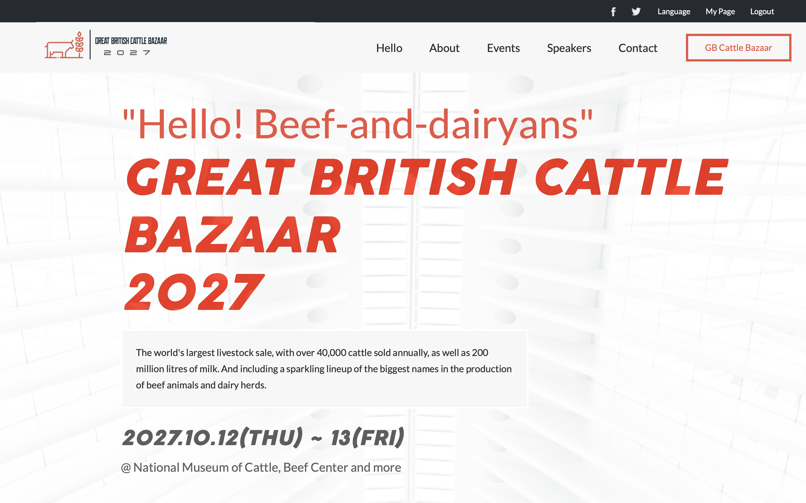
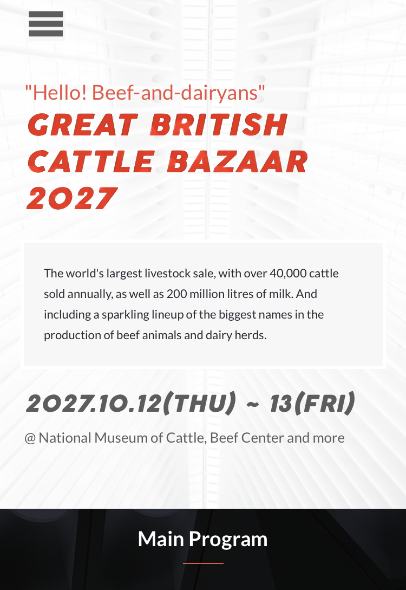

# Event-template

This is a spuff event website template based on the original design idea from designer [Cindy Shin](https://www.behance.net/adagio07), and content based on the [Beef and Dairy Network Podcast](https://www.beefanddairynetwork.com).

# Screenshots

- Desktop:

- Mobile:

- Loom video presentation:

## Built With

- HTML
- CSS
- JavaScript
- Visual Studio Code

## Live Demo

[Live Demo Link](https://danalvrz.github.io/event-template/)

## Authors

👤 **Dante Alvarez**

- GitHub: [@danalvrz](https://github.com/danalvrz)
- Twitter: [@danalvrz](https://twitter.com/danalvrz)
- LinkedIn: [Dante Álvarez](https://www.linkedin.com/in/dante-álvarez-85098a222/)

## Show your support

Give a ⭐️ if you like this project!

## 📝 License

This project is [MIT](./MIT.md) licensed.
